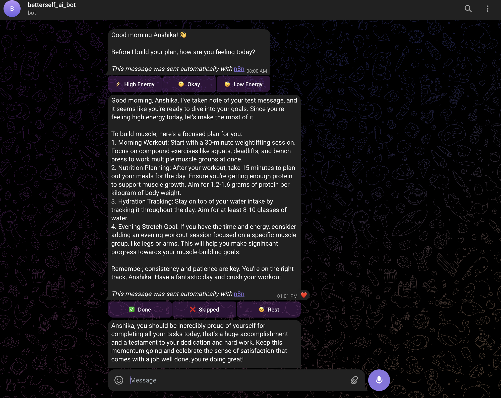
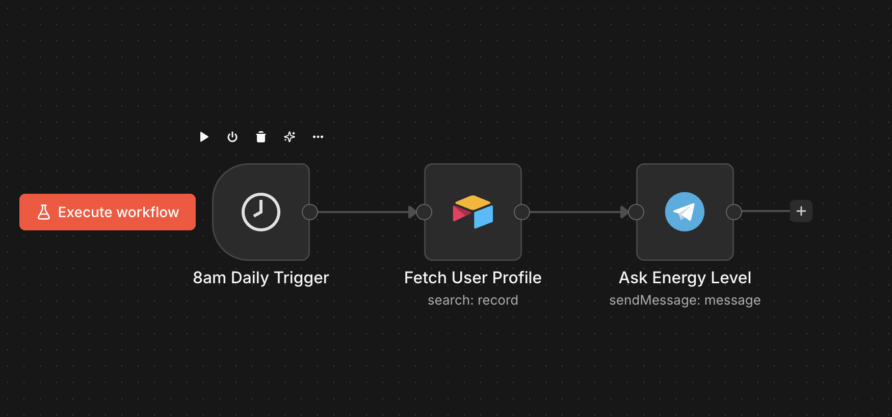
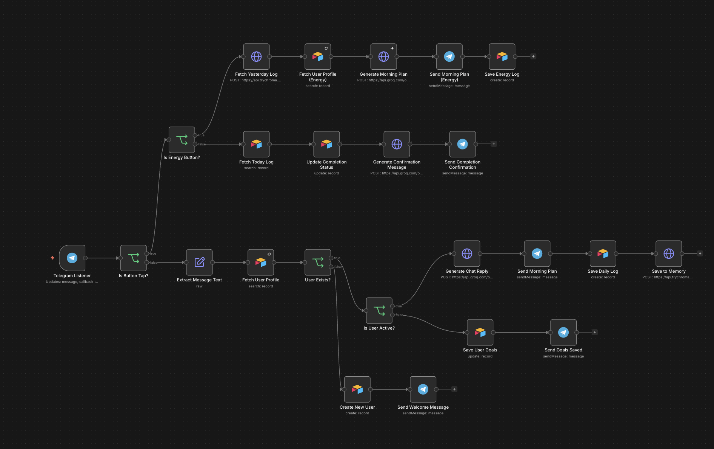
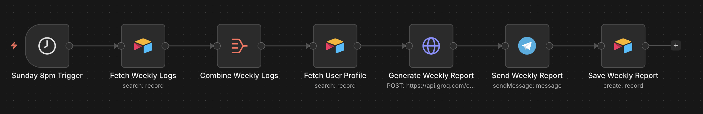
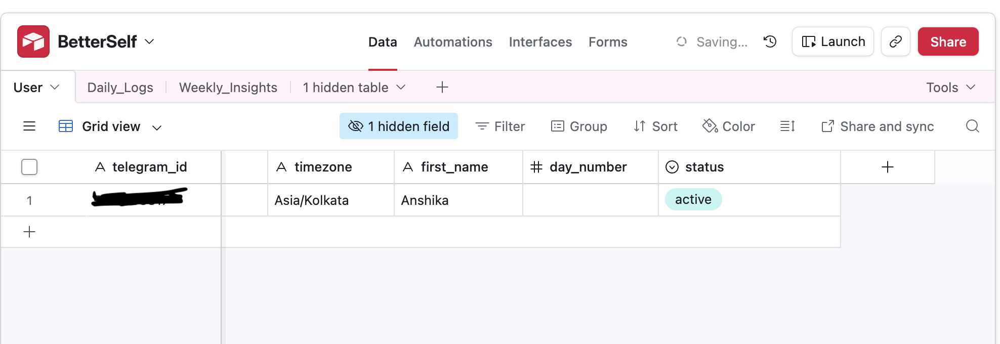
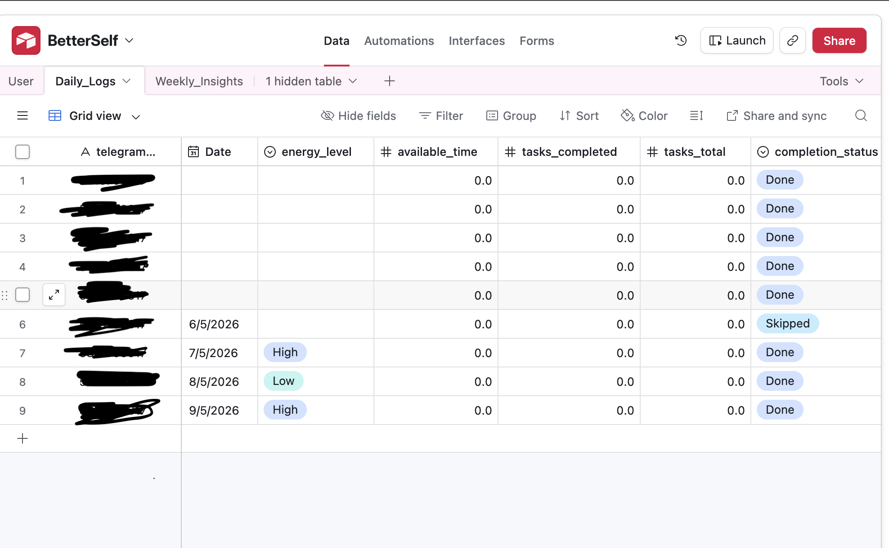
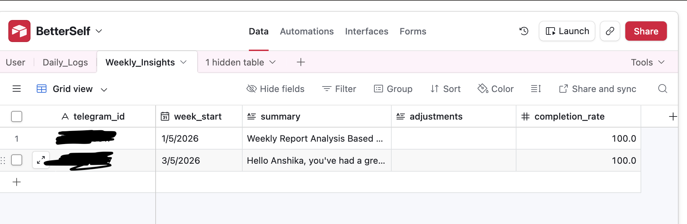

# BetterSelf.AI - AI Productivity Automation Engine

An end-to-end AI-powered personal productivity coach that lives on Telegram. Every morning it checks your energy, generates a personalized daily plan, lets you log progress with one tap, and delivers a weekly performance report every Sunday, fully automated with zero manual effort.

---

## Demo

### Telegram Bot in action


### Workflow 1 - Morning Energy Check-in


### Workflow 2 - Main Chat + Callbacks


### Workflow 3 - Weekly Report Generator


### Airtable - User profiles


### Airtable - Daily logs


### Airtable - Weekly insights


---

## Architecture

### Workflow 1 - Morning Energy Check-in (8am daily)
```
8am Schedule Trigger
        ↓
Fetch User Profile (Airtable)
        ↓
Send Telegram message with inline buttons:
  ⚡ High Energy | 😐 Okay | 😴 Low Energy
```

### Workflow 2 - Main Chat + Callbacks (always active)
```
Telegram Listener
        ↓
Is Button Tap?
  ├── YES → Is Energy Button?
  │           ├── YES (energy_high/okay/low)
  │           │     → Fetch Memory (ChromaDB)
  │           │     → Fetch User Profile (Airtable)
  │           │     → Generate Morning Plan (Groq)
  │           │     → Send Plan + Done/Skipped/Rest buttons
  │           │     → Save Energy Log (Airtable)
  │           │
  │           └── NO (Done/Skipped/Rest tap)
  │                 → Fetch Today Log (Airtable)
  │                 → Update Completion Status (Airtable)
  │                 → Generate Confirmation (Groq)
  │                 → Send Confirmation (Telegram)
  │
  └── NO (text message)
        → Extract Message Text
        → Fetch User Profile (Airtable)
        → User Exists?
              ├── YES → Is Active?
              │           ├── Active → Generate Chat Reply (Groq)
              │           │           → Send Reply (Telegram)
              │           │           → Save Daily Log (Airtable)
              │           │           → Save to Memory (ChromaDB)
              │           └── Onboarding → Save Goals → Send Confirmation
              └── NO → Create New User (Airtable) → Send Welcome Message
```

### Workflow 3 - Weekly Report (Sunday 8pm)
```
Sunday 8pm Trigger
        ↓
Fetch Weekly Logs (Airtable)
        ↓
Aggregate all rows into one
        ↓
Fetch User Profile (Airtable)
        ↓
Generate Weekly Report (Groq)
        ↓
Send Report (Telegram)
        ↓
Save Report (Airtable Weekly_Insights)
```

---

## Tech stack

| Tool | Purpose |
|---|---|
| n8n | Workflow automation (3 workflows) |
| Groq API (llama-3.3-70b-versatile) | Plan generation, chat replies, weekly reports |
| ChromaDB Cloud | Vector memory — stores user behavior context |
| Airtable | User profiles, daily logs, weekly insights |
| Telegram Bot API | User interface — all interactions happen here |

---

## Airtable schema

### Users table
| Field | Type | Purpose |
|---|---|---|
| telegram_id | Text | Unique user identifier |
| first_name | Text | Personalization |
| goals | Text | Used in every Groq prompt |
| timezone | Text | For scheduling |
| status | Select | onboarding / active |

### Daily_Logs table
| Field | Type | Purpose |
|---|---|---|
| telegram_id | Text | Links to Users |
| Date | Date | d/M/yyyy format |
| energy_level | Select | High / Okay / Low |
| completion_status | Select | Done / Skipped / Rest |
| available_time | Number | Minutes available |
| tasks_completed | Number | |
| tasks_total | Number | |

### Weekly_Insights table
| Field | Type | Purpose |
|---|---|---|
| telegram_id | Text | Links to Users |
| week_start | Date | Monday of that week |
| summary | Long Text | AI-generated report |
| completion_rate | Number | % of tasks done |

---

## Key technical decisions

**ChromaDB for memory**: User behavior patterns stored as vector embeddings. Retrieved before every plan generation to give the LLM context about past performance, enabling truly personalized recommendations over time.

**Energy-adaptive plans**: Groq prompt adjusts plan intensity based on energy level. Low energy triggers lighter tasks, high energy triggers ambitious goals. Same user gets a completely different plan depending on how they feel.

**One-tap logging**: Telegram inline keyboard buttons (Done/Skipped/Rest) update Airtable directly via callback queries. No typing required — zero friction for daily check-ins.

**Duplicate prevention**: Daily log updates existing row by matching telegram_id + Date instead of creating new records. Prevents data duplication on repeated taps.

**Markdown stripping**: All Groq responses run through `.replace(/[*_\`\[\]()#]/g, '')` before sending to Telegram. Telegram plain text mode doesn't render markdown so raw asterisks would show up otherwise.

**Weekly report structure**: Groq prompt engineered to produce a specific 6-part structure: greeting, visual completion bar (████░░ 67%), best day, energy pattern, goal-tied encouragement, and one focus for next week.

---

## Groq prompts engineered

**Morning Plan prompt**: Instructs the model to adjust intensity by energy level. Includes ChromaDB context for continuity across days.

**Chat Reply prompt**: Detects if message contains goals and saves them. Otherwise replies as a coaching assistant using the user's first name.

**Completion Confirmation prompt**: Generates warm 1-2 sentence reaction based on Done/Skipped/Rest status. Each response feels different.

**Weekly Report prompt**: Structured 6-part format. Analyzes 7 days of logs and produces actionable insights tied to the user's specific goals.

---

## Features built

- Daily energy check-in at 8am via Telegram inline buttons
- AI-generated morning plan adapts to energy level
- One-tap task completion logging (Done / Skipped / Rest)
- Dynamic Groq confirmation messages for each completion status
- ChromaDB vector memory for context-aware personalization
- Weekly AI performance report every Sunday at 8pm
- Goal saving via natural conversation
- New user onboarding flow with welcome message

---

## Known limitations & future improvements

- ChromaDB using dummy embeddings: real embeddings would improve context quality
- Currently single-user: telegram_id hardcoded in some filters
- Streak tracking not built yet
- Timezone field exists but not used for scheduling yet
- Yesterday's completion enrichment not yet active

---

## How to run this yourself

### Prerequisites
- n8n (cloud or self-hosted)
- Groq API key: groq.com (free tier)
- Telegram Bot Token: create via @BotFather
- Airtable account with 3 tables (Users, Daily_Logs, Weekly_Insights)
- ChromaDB Cloud account: trychroma.com

### Setup steps
1. Create Airtable base with the 3 tables and fields listed above
2. Create a Telegram bot via @BotFather and copy the token
3. Import all 3 workflow JSON files into n8n
4. Add credentials: Groq API key, Telegram token, Airtable token, ChromaDB API key
5. Update YOUR_TELEGRAM_ID in workflow filters with your actual Telegram ID
6. Activate all 3 workflows
7. Message your bot to trigger onboarding

---

## Project structure

| File | Description |
|---|---|
| workflow-1-morning-plan.json | 8am daily energy check-in workflow |
| workflow-2-main-chat.json | Main Telegram listener + callback handler |
| workflow-3-weekly-report.json | Sunday weekly report generator |
| workflow-1-morning.png | Workflow 1 screenshot |
| workflow-2-main.png | Workflow 2 screenshot |
| workflow-3-weekly.png | Workflow 3 screenshot |
| airtable-users.png | Users table screenshot |
| airtable-daily-logs.png | Daily logs table screenshot |
| airtable-weekly-insights.png | Weekly insights table screenshot |
| telegram-bot.png | Bot in action screenshot |
| README.md | This file |

---

## What I learned

- Building multi-workflow Telegram bots with n8n callback query handling
- Using ChromaDB vector database for LLM memory and context retrieval
- Prompt engineering for energy-adaptive personalized plans
- Designing Airtable schemas for time-series behavioral data
- Debugging Telegram API callback_data and inline keyboard interactions
- Aggregating multi-row Airtable data before passing to LLM

---

## Author

Built by Anshika Gupta · https://www.linkedin.com/in/anshika-gupta1008/ · https://github.com/AnshikaGupta0124
